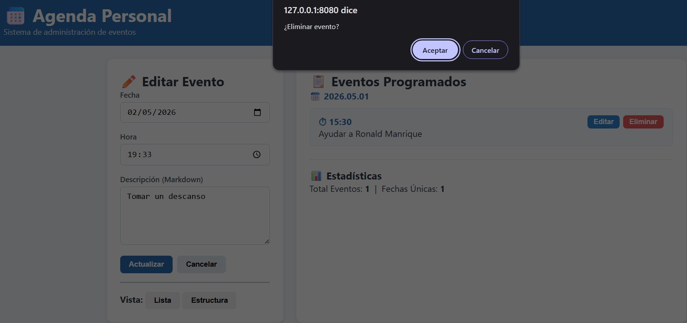

# 📅 Agenda Personal - Laboratorio 03 (DAW)

Este proyecto es una aplicación web de administración de eventos desarrollada con **Node.js** y **Express**, diseñada para ser ejecutada de manera portátil y consistente mediante **Docker**. El laboratorio cumple con los objetivos de despliegue y gestión de servidores web estipulados en la guía de práctica.

## 🚀 Características Principales
- **Arquitectura REST**: API para crear, listar, editar y eliminar eventos.
- **Persistencia en Markdown**: Los eventos se guardan físicamente en el servidor organizados por fecha y hora.
- **Contenedorización**: Configuración completa con Docker para evitar problemas de dependencias locales.
- **Interfaz Web**: Frontend dinámico que consume la API del servidor.

---

## 📂 Estructura del Proyecto

El proyecto está organizado siguiendo el principio de separación de responsabilidades:

```text
lab-03-daw/
├── agenda/             # Almacenamiento persistente de eventos (.md)
├── pub/                # Archivos estáticos servidos al cliente
│   ├── css/            # Estilos visuales
│   ├── js/             # Lógica del frontend (agenda.js)
│   └── index.html      # Interfaz de usuario principal
├── app.js              # Servidor principal y definición de API Express
├── Dockerfile          # Instrucciones para construir la imagen Docker
├── .dockerignore       # Archivos excluidos del contenedor (node_modules)
├── package.json        # Dependencias del proyecto (Express)
└── package-lock.json   # Registro de versiones exactas
```

## 🐳 Despliegue con Docker

Sigue estos pasos para construir y ejecutar la aplicación en un contenedor aislado:

### 1. Construcción de la Imagen
Desde la raíz del proyecto (donde se encuentra el `Dockerfile`), ejecuta el siguiente comando para compilar la imagen:
```bash
docker build -t lab03-agenda .
```
## 📸 Demostración de Funcionamiento

### 1. Creación de Tareas
Para probar el sistema, se crearon tres tareas de ejemplo mediante la interfaz web:


### 2. Persistencia en el Servidor
Se puede observar cómo Docker crea los archivos `.md` dentro de la carpeta `agenda/` automáticamente:


### 3. Eliminación de Tareas
Al presionar el botón de eliminar, el sistema borra los archivos físicos del contenedor:

